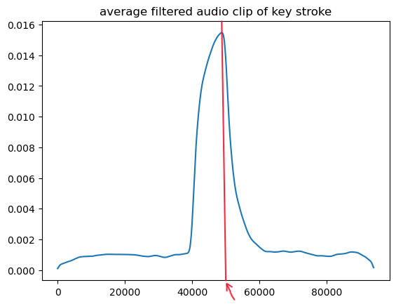
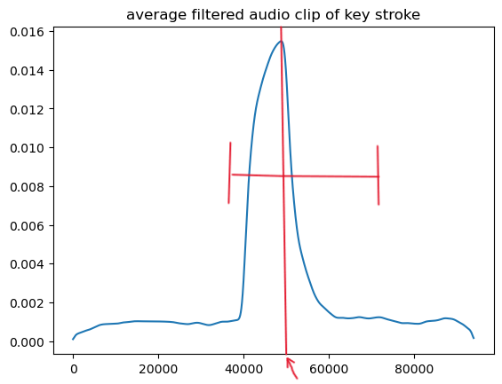
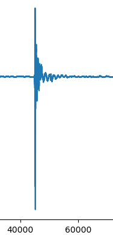
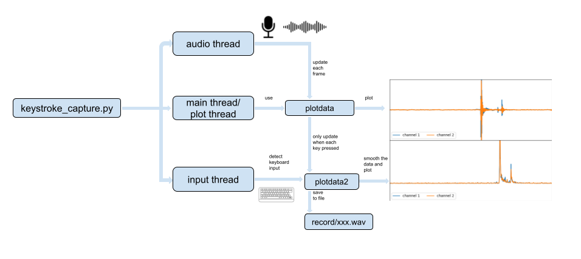
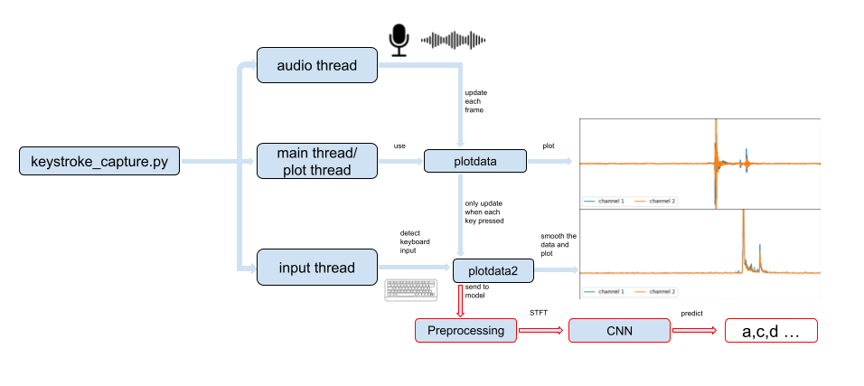

# CS545-Final
Peiheng Lyu, Ortiz, Michael Philip, Wang, Hanqing
<br/><br/>

## Stage 1. Build Dataset:
To do List:
- [X] Step 1 (Michael)
- [X] Step 2 (Peiheng)
- [X] Step 3 (hanqing5)
#### Step 1: Identify and Extract Keystrokes
We require a function that can detect and pinpoint keystrokes within a given time series. Our current method involves using a smoothing filter to identify the peaks in the time series. The code snippet below illustrates this approach:
```python
#fre_axis and smooth_filter function are in test.ipynb
fre_axis(sr_key,smooth_filter(x_keys[s_i],4),'average filtered audio clip of key stroke')
```


Next, we define an interval like so:



Using this interval, we trim the corresponding segment from the original sound, resulting in:



Which is the format we want. This step standardizes the data in our dataset.


#### Step 2: Record Keystroke Sounds
The keystroke_capture.py script allows for real-time audio collection. Running this script initiates three concurrent threads, structured as follows:



1. The audio thread will call the audio_callback() function to capture new data streams from recording and place them in a queue.
2. The main thread/plot thread will call the update_plot() function. This function reads data from the queue and updates plotdata. Subsequently, the thread renders the updated plotdata.
3. The input thread will call the user_input() function, which continuously captures keyboard input in the terminal. Upon pressing any key, the program will display the pressed key and save the corresponding signal data to a file. A smoothed signal graph of this data will be displayed on the second plot, which you can use to verify if the signal is captured properly.

When you execute keystroke_capture.py, a window with two plots will appear, and the terminal will begin capturing keyboard input. Typing any character in the terminal will trigger signal capture. To terminate the input thread, enter a special function key such as 'Delete' or 'Insert'. To close the plot and audio threads, simply close the plot window.

Currently, sounds are captured by saving the entire stream cache after a brief delay (default set to 0.4 seconds). This is because capturing immediately after a key press may not give enough time for the sound to be integrated into plotdata. The position of the keystroke in the data is not standardized.

The format of the saved file follows the '{key}{count}.wav' structure, where 'key' represents the letter of the pressed key when the signal was recorded, and 'count' is an automatically incrementing number to distinguish between files with the same 'key'.

#### Step 3: train a noise cancelling method
Upon completing Step 2, we aim to develop a noise-cancelling technique that extracts keystrokes from noisy recordings, e.g., converting 'keystroke0.wav' (noisy) into 'keystroke1.wav' (noise-reduced). This method will be crucial for both further data collection and final prediction.

<!-- An approach is provided in "448 Lab which maybe useful" folder. We can use the same method in it, or probably a better method which developed by ourself.  -->

<br/><br/>
<br/><br/>

## Stage 2. Build Prediction Model:


#### Step 1: Build Deep Learning Model
1. CNN (Our current approach)
The structure of our CNN is as follows:
```python
class Net(nn.Module):
        def __init__(self):
            super(Net, self).__init__()
            self.conv1 = nn.Conv2d(2, 16, 3, 1, padding=1)
            self.conv2 = nn.Conv2d(16, 32, 3, 1, padding=1)
            self.pool = nn.MaxPool2d(2, 2)
            self.dropout1 = nn.Dropout(0.25)
            self.dropout2 = nn.Dropout(0.5)
            self.fc1 = nn.Linear(69632, 128)
            self.fc2 = nn.Linear(128, 29)

        def forward(self, x):
            x = self.conv1(x)
            x = F.relu(x)
            x = self.pool(x)
            x = self.conv2(x)
            x = F.relu(x)
            x = self.pool(x)
            x = self.dropout1(x)
            x = torch.flatten(x, 1)
            x = self.fc1(x)
            x = F.relu(x)
            x = self.dropout2(x)
            x = self.fc2(x)
            output = F.log_softmax(x, dim=1)
            return output
```
Our input data have 2 channel which is left and right channel of the microphones. Just similar to the RGB channels of a image.

2. RNN (Not implemented yet)
...

#### Step 2: Test On Data Set
Our model's performance on the dataset is as follows:

Small scale, no noise: 96% accuracy

median scale, minimal noise: 87% accuracy

Large scale, noticeable noise: 85% accuracy


#### Step 3: Real-Time Prediction
After dataset testing, we integrate the model with our real-time keystroke capture program. The modified structure is:



The key change involves replacing the file-saving process with real-time predictions using our CNN model.